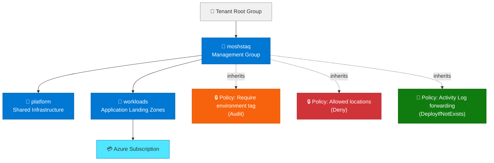
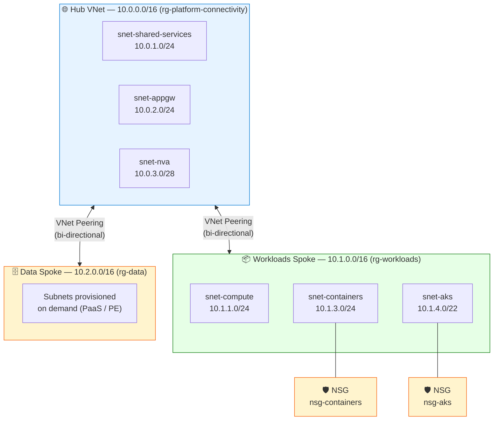
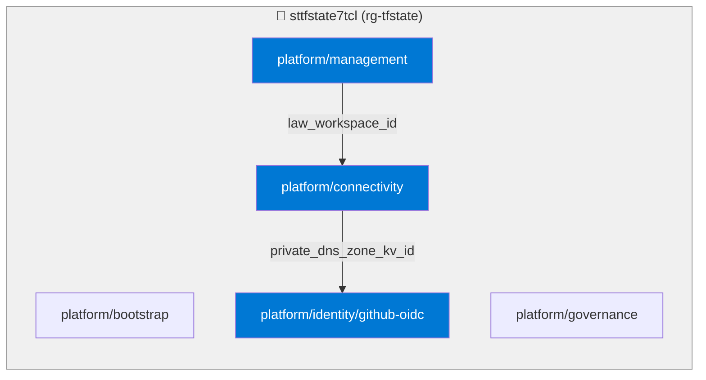
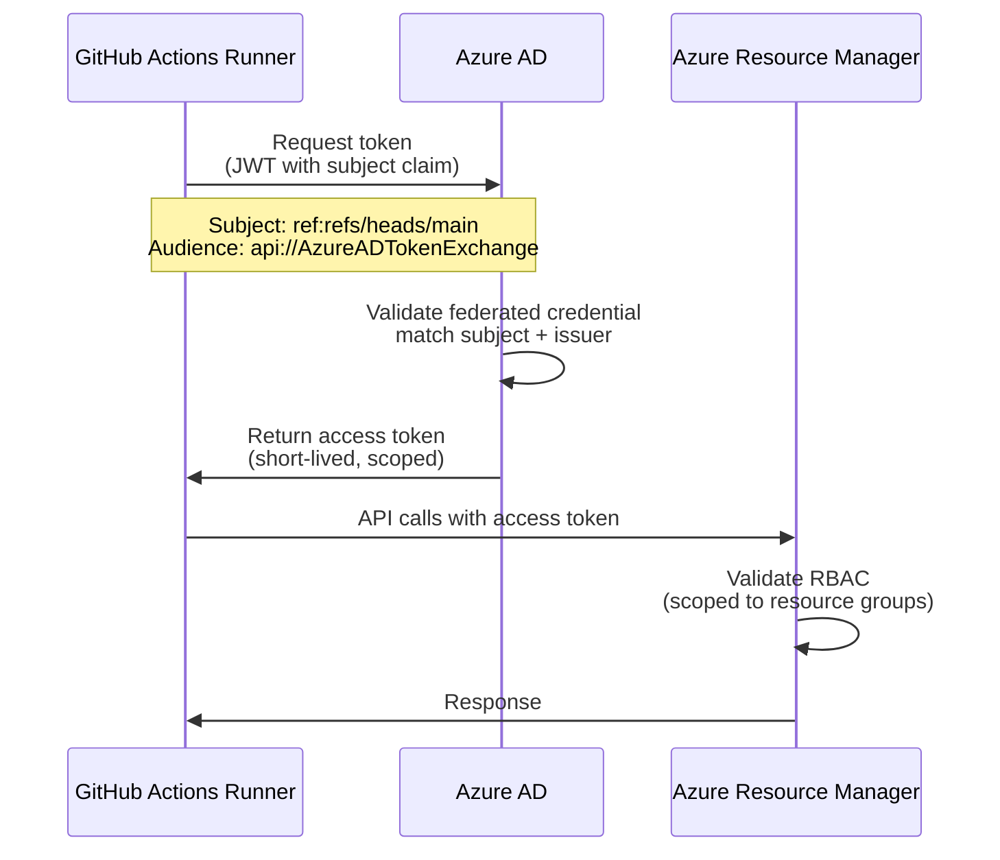
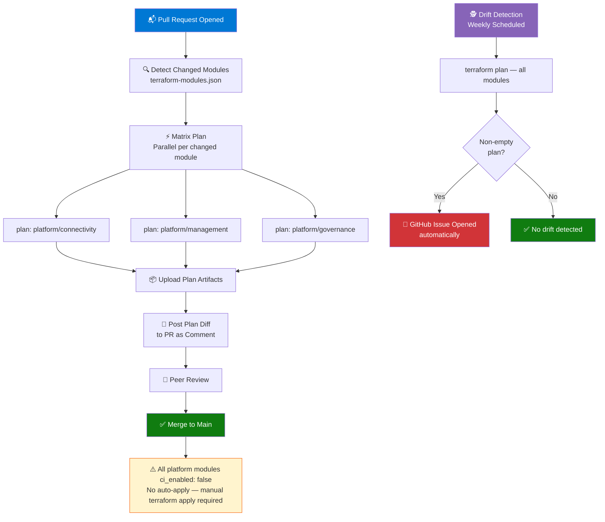
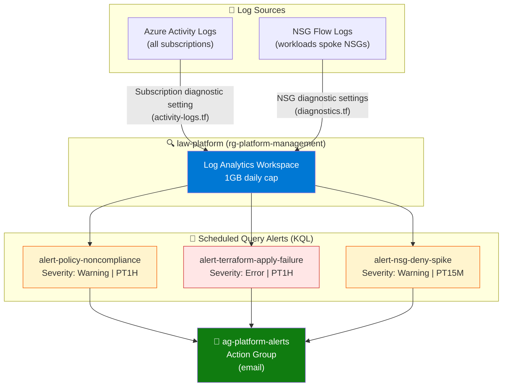

# Architecture

This document covers the design of each layer of the landing zone — management hierarchy, networking, identity, CI/CD, and observability. All diagrams reflect the actual deployed infrastructure.

---

## Management Group Hierarchy

Policy assignments at the `moshstaq` management group propagate down to all child management groups and subscriptions automatically. No per-subscription policy configuration required.

---

## Hub-Spoke Network Topology

The hub VNet is owned by the platform team. Spoke VNets are owned by landing zones. Peering is bi-directional — spoke traffic can reach hub shared services, hub can reach spoke workloads.

---

## Terraform State Architecture

Each module owns an isolated state file. Cross-module references use `terraform_remote_state` data sources — resource IDs flow between modules without hardcoding. Arrows show the direction of the dependency (the module at the tail reads from the module at the head).

> `platform/connectivity` reads `law_workspace_id` from `platform/management` to configure NSG diagnostic settings. `platform/identity/github-oidc` reads `private_dns_zone_kv_id` from `platform/connectivity` to create the DNS zone RBAC assignment for `taskflow-platform`. This means management must be applied before connectivity, and connectivity before identity.

---

## Identity & OIDC Authentication

No secrets stored in GitHub. The runner exchanges a short-lived JWT for an Azure access token scoped to specific resources.

### Federated Credential Subjects

Two credentials are configured per repository — one for each distinct GitHub event type:

| Credential             | Subject Claim         | Workflow            |
| ---------------------- | --------------------- | ------------------- |
| `github-main-branch`   | `ref:refs/heads/main` | Direct push applies |
| `github-pull-requests` | `pull_request`        | PR plan jobs        |

A token issued for a PR plan job **cannot** be used to trigger an apply — the subject claims don't match. This is enforced by Azure AD, not by workflow logic.

---

## CI/CD Pipeline

---

## Observability Architecture

---

## Resource Group Layout

| Resource Group             | Tier         | Purpose                                | Lifecycle                                   |
| -------------------------- | ------------ | -------------------------------------- | ------------------------------------------- |
| `rg-tfstate`               | Platform     | Terraform remote state storage         | Permanent                                   |
| `rg-platform-connectivity` | Platform     | Hub VNet, spokes, NSGs, NVA, DNS zones | Permanent                                   |
| `rg-platform-management`   | Platform     | Log Analytics, alerts, backup, budgets | Permanent                                   |
| `rg-workloads`             | Landing Zone | Workloads spoke VNet and subnets       | Permanent                                   |
| `rg-data`                  | Landing Zone | Data spoke VNet                        | Permanent                                   |
| `rg-taskflow`              | Landing Zone | Empty boundary for taskflow-platform   | Permanent (boundary) / Ephemeral (contents) |

---

## Design Decisions

### Why hub-spoke over a flat VNet?

Spoke VNets are independently managed — the workloads team controls their address space, subnets, and NSGs without touching platform networking. Adding a second landing zone is a new spoke, not a change to existing infrastructure. The hub provides a single point for shared services and NVA-enforced inter-spoke routing.

### Why modular state over a single backend?

A monolithic state file means any Terraform operation locks the entire infrastructure. Separate state per module means platform changes don't block workload deployments and vice versa. It also limits the blast radius of a corrupted state file to one module.

### Why OIDC over service principal secrets?

Secrets rotate, get leaked, and require management overhead. OIDC federated credentials are bound to specific GitHub subjects (branch, PR) and issued as short-lived tokens. There is no credential to leak because no credential is stored.

### Why sequential apply but parallel plan?

Plan operations are read-only against the Azure API and idempotent — parallelising them is safe and speeds up PR feedback. Apply operations have ordering dependencies (management must exist before connectivity can read its state outputs), so sequential execution with explicit ordering prevents race conditions.

### Why all platform modules have ci_enabled: false?

Platform infrastructure is sensitive. Auto-applying connectivity, governance, or identity changes could have wide blast radius — a misconfigured NSG affects all spokes, an identity mistake could lock the pipeline out of itself. Manual apply forces human review of every platform change. Speed is not the priority here.
